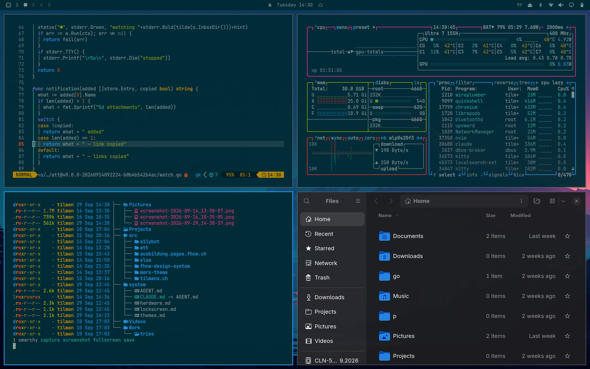

# Solarized Dark

A dark [Omarchy](https://omarchy.org) theme for [Ethan Schoonover's Solarized](https://ethanschoonover.com/solarized/) — the classic muted, low-contrast, precisely-calibrated palette, with its distinctive teal-tinted near-black background.



## Install

```bash
omarchy theme install https://github.com/tilman-schieber/omarchy-solarized-dark-theme
```

## Palette

| Role | Color |
|---|---|
| accent | `#268bd2` (blue) |
| background | `#002b36` (base03) |
| lighter background | `#073642` (base02) |
| selection | `#073642` (base02) |
| foreground | `#839496` (base0) |
| bright foreground | `#93a1a1` (base1) |

Every value in [`colors.toml`](colors.toml) is a literal, official Solarized color — nothing here is an invented approximation. The ANSI colors (and their "bright" variants) follow Solarized's own canonical 16-color terminal mapping, the same one used by every well-known Solarized terminal port: `bright_red` is really `orange` (`#cb4b16`), `bright_magenta` is really `violet` (`#6c71c4`), and so on. The only extrapolated values are the two background tiers darker than the spec's own darkest tone (`base03`) — those are computed by darkening `base03`'s lightness, since Solarized doesn't define anything below it.

When you install from this repo, Omarchy skips `hyprland.lua`, `neovim.lua`, and terminal configs — those get regenerated from `colors.toml` through Omarchy's own templates instead.

Icons use `Yaru-blue`, matching the accent.

## Backgrounds

Five wallpapers:

- `1-mountains.png`, `2-dragon-fractal.png`, `3-city-buildings.png` — already built on the exact Solarized palette (no recoloring needed), from [GasparVardanyan/themes](https://gitlab.com/GasparVardanyan/themes) on GitLab
- `4-solarized-osaka.jpg`, `5-fuji-city.jpg` — from a Reddit [r/wallpaper post](https://www.reddit.com/r/wallpaper/comments/1qxpmbj/solarized_osaka_3440x2160) titled "Solarized Osaka"

**Note on provenance:** none of these five have a clear, explicit reuse license. The GitLab repo above has no `LICENSE` file, no license field, and no artist attribution. Reddit posts don't carry any redistribution license either — Reddit's own terms only grant Reddit itself a license to display what's posted, not a license for third parties to reuse it. Treat all five as "found on the public internet," not as clearly-licensed assets — swap them out if that matters for your use.
